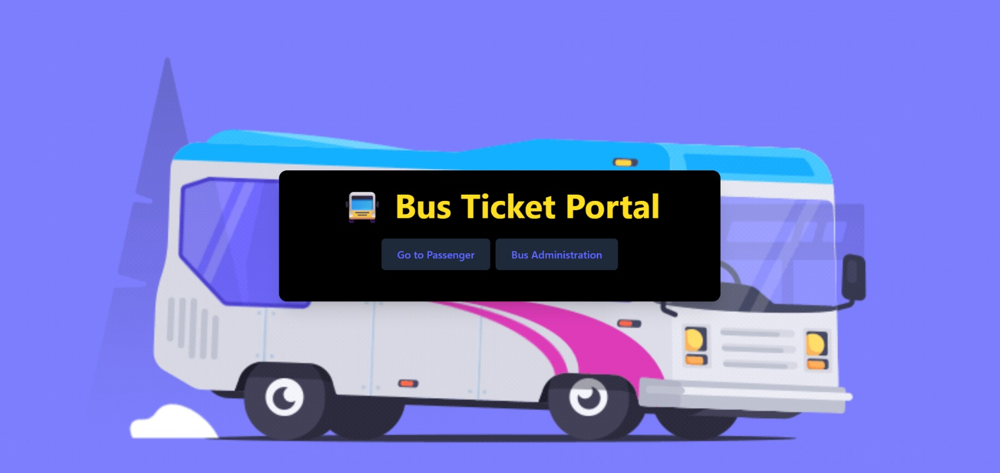
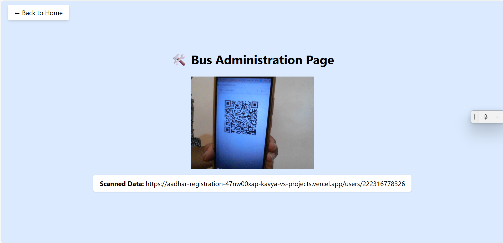

## 🚍 SnapTicket – QR-Based Smart Bus Ticketing System

SnapTicket is a smart, paperless bus ticketing system built using React, Firebase, and Node.js.  
It allows passengers to register using their Aadhar number, generate a unique QR-based e-ticket, and receive travel details via email.  
Conductors can scan the QR to fetch passenger details and validate tickets in real-time.

---

### 🎯 Features

- ✅ Passenger registration with Aadhar & email  
- ✅ Unique QR code generation and download (PDF/Image)  
- ✅ Real-time QR scanning by conductors  
- ✅ Automatic email sending with travel ticket details  
- ✅ Firebase Firestore integration for data storage  
- ✅ Firebase Authentication for admin access  
- ✅ Responsive design using Tailwind CSS  
- ✅ Node.js backend for secure email delivery

  ---

### 🖼 Screenshots

## 🖼 Screenshots

  
  

  
    

  <!-- Add a second image here if needed -->

